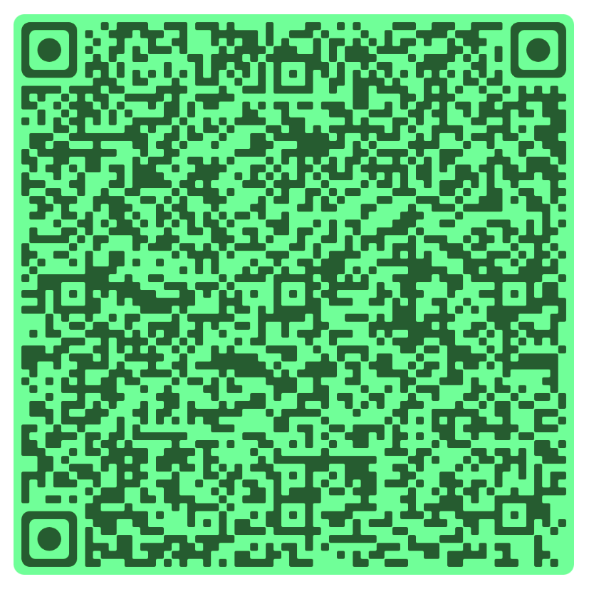

PS: Please don't try to solve this manually by hand :\)

If you read the script.js code, you'll see there's a state variable that stores the location for each image and a function that queries api.php to check for the color of each image, among other things.
Just write code to query the API for states like [0,1,2, ... 62,63], [63,0,1, ... 61,62], [62,63,0, ... 60,61], ... 64 times, and you'll know the correct position for each image.

There are other correct methods to solve the problem, too.